# Event Reservation Demo

A Dockerized event reservation platform built as a reactive microservices' system.

The implementation goes beyond a minimal CRUD kata: it includes a Backend-for-Frontend (BFF), OAuth2/OpenID Connect authentication with Keycloak, server-side sessions in Redis, per-service MongoDB persistence, synchronous service-to-service calls where an immediate answer is required, Kafka-based asynchronous integration events, an Angular frontend, and an Nginx HTTPS entry point.

The complete application can be launched with Docker Compose. No local Java, Maven, Node.js, MongoDB, Redis, Kafka, or Keycloak installation is required for normal execution.

---

## Table of contents

- [Architecture](#architecture)
- [Main implementation decisions](#main-implementation-decisions)
- [Project structure](#project-structure)
- [Prerequisites](#prerequisites)
- [Keycloak configuration](#keycloak-configuration)
- [Launching the application](#launching-the-application)
- [Application URLs](#application-urls)
- [Useful Docker Compose commands](#useful-docker-compose-commands)
- [Tests and code coverage](#tests-and-code-coverage)
- [Troubleshooting](#troubleshooting)

---

## Architecture

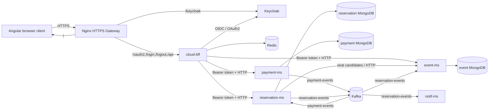
```mermaid
flowchart LR
    Browser[Angular browser client]
    Gateway[Nginx HTTPS Gateway]
    BFF[cloud-bff]
    KC[Keycloak]
    Redis[(Redis)]

    Event[event-ms]
    Reservation[reservation-ms]
    Payment[payment-ms]
    Notification[notif-ms]

    EventMongo[(event MongoDB)]
    ReservationMongo[(reservation MongoDB)]
    PaymentMongo[(payment MongoDB)]

    Kafka[(Kafka)]

    Browser -->|HTTPS| Gateway
    Gateway -->|/| Browser
    Gateway -->|/oauth2,/login,/logout,/api| BFF
    Gateway -->|/keycloak| KC

    BFF -->|OIDC / OAuth2| KC
    BFF --> Redis

    BFF -->|Bearer token + HTTP| Event
    BFF -->|Bearer token + HTTP| Reservation
    BFF -->|Bearer token + HTTP| Payment

    Reservation -->|seat candidates / HTTP| Event

    Event --> EventMongo
    Reservation --> ReservationMongo
    Payment --> PaymentMongo

    Payment -->|payment-events| Kafka
    Kafka -->|payment-events| Reservation

    Reservation -->|reservation-events| Kafka
    Kafka -->|reservation-events| Event
    Kafka -->|reservation-events| Notification
```

All backend services communicate over the Docker network by service name. The browser does **not** call the microservices directly.

The public entry point is:

```text
https://localhost
```

Nginx terminates TLS and routes browser traffic to the Angular application, the BFF, or Keycloak. Internal microservice traffic remains on the Docker network and uses HTTP.

### Components

| Component | Responsibility |
| --- | --- |
| `front` | Angular UI. Talks only to the BFF through the public gateway. |
| `gateway` | Nginx HTTPS reverse proxy and single public entry point. |
| `cloud-bff` | OAuth2 login, server-side user session, CSRF protection, token relay, API proxying, response aggregation. |
| `keycloak` | Identity and Access Management / OpenID Connect provider. |
| `redis` | Distributed Spring Session store used by the BFF. |
| `event-ms` | Event catalog, seat layout and event availability projection. |
| `reservation-ms` | Reservation lifecycle and authoritative seat-concurrency protection. |
| `payment-ms` | Payment lifecycle and payment persistence. (simulated) |
| `notification-ms` | Asynchronous reservation notification/logging consumer. (todo: use spring-mail to implement a real SMTP server) |
| Kafka | Asynchronous communication between payment, reservation, event and notification services. |
| MongoDB instances | One database per business microservice. |

---

## Main implementation decisions

### 1. Backend-for-Frontend instead of exposing OAuth tokens to Angular

The frontend never stores an OAuth2 access token or refresh token.

Authentication uses the OAuth2/OpenID Connect **Authorization Code flow with PKCE (S256)**. The browser is redirected to Keycloak through the public HTTPS gateway, while the BFF performs the server-side OAuth2 client work.

After authentication:

- OAuth2 tokens remain server-side.
- Spring Security stores the authenticated session through Spring Session.
- Redis persists that session.
- The browser receives only the BFF session cookie.
- Calls to `/api/**` are authenticated through that server-side session.
- When the BFF calls a microservice, Spring Security attaches the authenticated user's access token as a Bearer token.

This keeps access and refresh tokens out of browser JavaScript and centralizes OAuth2 concerns in `cloud-bff`.

### 2. Public Keycloak URL versus Docker-internal Keycloak URL

This is one of the most important configuration details.

The browser-facing issuer is:

```text
https://localhost/keycloak/realms/carrefour_kata_realm
```

The browser must use the public HTTPS hostname because the authorization flow happens in the user's browser.

Docker containers, however, must **not** use `localhost` to reach Keycloak: inside a container, `localhost` means that same container.

For internal calls, services use Docker DNS, for example:

```text
http://keycloak:8080/keycloak/realms/carrefour_kata_realm/protocol/openid-connect/certs
```

The token issuer still needs to be the public issuer:

```text
https://localhost/keycloak/realms/carrefour_kata_realm
```

This split between the public issuer and internal network endpoints avoids container-routing problems and unnecessary TLS trust problems for internal calls.

### 3. BFF proxying and token relay

Browser routes are exposed through the BFF:

```text
/api/events/**
/api/reservations/**
/api/payments/**
```

The BFF forwards requests to the Docker-internal services:

```text
http://event-ms:8080
http://reservation-ms:8080
http://payment-ms:8080
```

The proxy deliberately does **not** blindly forward security-sensitive browser headers. In particular, the implementation strips headers such as:

```text
Authorization
Cookie
X-XSRF-TOKEN
Host
Content-Length
Connection
```

The downstream `Authorization` header is then supplied by the BFF's OAuth2-aware `WebClient`, using the server-side authorized client.

The BFF also forwards the original HTTP method, path, query string and request body.

### 4. CSRF protection

Because browser authentication is session/cookie based, CSRF protection remains enabled.

The BFF uses a cookie-based CSRF token repository. Angular can read the CSRF cookie and returns the token in:

```text
X-XSRF-TOKEN
```

for mutating requests such as POST, PUT, PATCH and DELETE.

That browser CSRF header is consumed at the BFF boundary and is not forwarded to downstream microservices.

### 5. Correlation IDs

Every request has an:

```text
X-Correlation-Id
```

If the incoming request already contains a non-empty correlation ID, the BFF preserves it. Otherwise it generates a UUID.

The correlation ID is added to the forwarded request and response, stored in Reactor Context, and propagated by the BFF's `WebClient` to downstream services. This makes it possible to correlate one browser operation across BFF and microservice logs.

### 6. Downstream timeout/error semantics

The BFF's service-to-service `WebClient` uses bounded network timeouts rather than waiting indefinitely.

The current implementation uses:

```text
Connect timeout:  3 seconds
Response timeout: 5 seconds
Read timeout:     5 seconds
Write timeout:    5 seconds
```

Proxy transport errors are translated as follows:

```text
Timeout / read timeout        -> 504 Gateway Timeout
Connection/request failure    -> 502 Bad Gateway
Unexpected exception          -> propagated
```

### 7. Reactive stack

The backend uses Spring WebFlux and Reactor. The reactive model is carried through HTTP handlers and reactive MongoDB repositories rather than wrapping blocking persistence calls in reactive types.

Typical return types are:

```text
Mono<T>   - zero or one result
Flux<T>   - zero or many results
```

### 8. Ports-and-Adapters / Hexagonal architecture

Business microservices separate the core domain from infrastructure concerns.

Conceptually:

```text
domain
  ^
  |
application
  ^
  |
infrastructure adapters
```

The domain contains business rules and models. Application services implement use cases through input/output ports. Infrastructure contains concrete adapters such as WebFlux REST controllers, MongoDB repositories and persistence mappers, Kafka producers/consumers, `WebClient` HTTP adapters, and Spring configuration.

The intent is to prevent business rules from depending directly on Spring WebFlux, MongoDB or Kafka.

### 9. Reservation concurrency is enforced by MongoDB

The reservation service is the authoritative source for seat reservation state.

A seat must not be held or confirmed by two concurrent reservations. This is enforced at database level with a unique partial MongoDB index over the active reservation key:

```text
(eventId, seatId)
```

with the uniqueness constraint applying only to active reservations.

Conceptually:

```javascript
db.reservations.createIndex(
  { eventId: 1, seatId: 1 },
  {
    unique: true,
    partialFilterExpression: { active: true },
    name: "uq_active_reservation_per_seat"
  }
)
```

This is deliberately stronger than an in-memory lock because the database remains the final concurrency authority even if several reservation-service instances run concurrently.

An additional index supports expiration scans:

```javascript
db.reservations.createIndex(
  { status: 1, expiresAt: 1 },
  { name: "idx_status_expires_at" }
)
```

### 10. Reservation hold expiration

Reservations initially enter a temporary held state.

A lightweight scheduler searches for expired held reservations and transitions them to the expired state. Spring Batch is intentionally not used because this is a small periodic state-transition job rather than a large ETL/batch-processing workload.

Typical lifecycle states are:

```text
HELD
CONFIRMED
EXPIRED
CANCELLED
```

`HELD` and `CONFIRMED` block seat availability; expired/cancelled reservations release it.

### 11. Synchronous and asynchronous communication are used deliberately

Not every service interaction has the same latency requirements.

The reservation flow needs an immediate answer when looking for seat candidates, so `reservation-ms` calls `event-ms` synchronously for real-time candidate information.

Lifecycle propagation does not need to block the original HTTP request, so Kafka is used for that part.

The main event flow is:

```text
payment-ms
    |
    | payment-events
    v
Kafka
    |
    v
reservation-ms
    |
    | reservation-events
    v
Kafka
   / \
  /   \
event-ms  notif-ms
```

`event-ms` and `notif-ms` use different Kafka consumer groups so that both independently receive reservation lifecycle events.

Reservation lifecycle messages are keyed by reservation identity so ordering for the same reservation can be preserved within a Kafka partition.

### 12. Event availability is a projection, not the reservation concurrency authority

`event-ms` maintains a derived availability view from reservation lifecycle events.

Conceptually:

```text
HELD       -> remaining seats - 1
CONFIRMED  -> no additional change
CANCELLED  -> remaining seats + 1
EXPIRED    -> remaining seats + 1
```

A confirmed reservation does not decrement availability a second time because the seat was already blocked when the reservation entered `HELD`.

This projection is useful for displaying availability, but `reservation-ms` and its MongoDB uniqueness constraint remain the authoritative protection against double booking.

### 13. One database per microservice

Business services do not share a MongoDB database.

Typical Docker-internal database URLs are:

```text
event-ms       -> mongodb://mongo-event:27017/event_db
reservation-ms -> mongodb://mongo-reservation:27017/reservation_db
payment-ms     -> mongodb://mongo-payment:27017/payment_db
```

This preserves service data ownership and avoids cross-service database coupling.

UUID values are stored using MongoDB's standard UUID representation:

```yaml
spring:
  mongodb:
    representation:
      uuid: standard
```

### 14. BFF aggregation endpoints

The BFF does more than simple reverse proxying for user-oriented views.

`GET /api/reservations` loads the current user's reservations from `reservation-ms`, deduplicates their event IDs, obtains event details from `event-ms`, then maps the result into `ReservationViewResponse`. If an event is no longer available, the reservation is still returned with `Unknown event` rather than being discarded.

`GET /api/payments` aggregates payment data with reservation and event information. Missing reservation/event data is handled without discarding the payment itself.

Internal aggregation endpoints such as `/internal/events/**` are intended only for service-to-service use and should not be exposed by Nginx as public browser routes.

---

## Project structure

The repository is organized approximately as follows:

```text
.
├── cloud-bff/
├── event-ms/
├── reservation-ms/
├── payment-ms/
├── notification-ms/
├── front/
├── gateway/
│   ├── nginx.conf
│   └── certs/
├── docker-compose.yml
└── README.md
```

Each Java service has its own Maven build and Dockerfile. Docker images use multi-stage builds so compilation happens in a Maven/JDK image while runtime uses a Java runtime image.

---

## Prerequisites

Only Docker is required to launch the complete stack.

### macOS / Linux

Install Docker Engine with Docker Compose v2 available.

Verify:

```bash
docker --version
docker compose version
```

### Windows

Install **Docker Desktop** and make sure Docker Desktop is running before starting the project.

Verify in PowerShell:

```powershell
docker --version
docker compose version
```

No local installation of Java 25, Maven, Node.js, MongoDB, Redis, Kafka or Keycloak is required when using the Docker Compose workflow.

---

# Keycloak configuration

Keycloak must be configured before the first successful application login.

If the Keycloak data volume already contains this realm and client, this setup does not need to be repeated.

> **Important:** `docker compose down -v` removes Docker volumes, but Keycloak volume is external, using `-v` does not remove the manually configured realm/client and the setup below must be done only once.

## 1. Start the Docker stack

Before starting, create the external keycloak data volume named keycloak-db.

From the repository root:

```bash
docker volume create keycloak-db
```

```bash
docker compose build
docker compose up -d
```

Check the containers:

```bash
docker compose ps
```

Wait until Keycloak is ready before opening its administration console at.

```text
https://localhost/keycloak/admin/master/console
```

Use the Keycloak administrator credentials configured in the project's Docker Compose/environment configuration.

```text
username: admin
password: admin
```

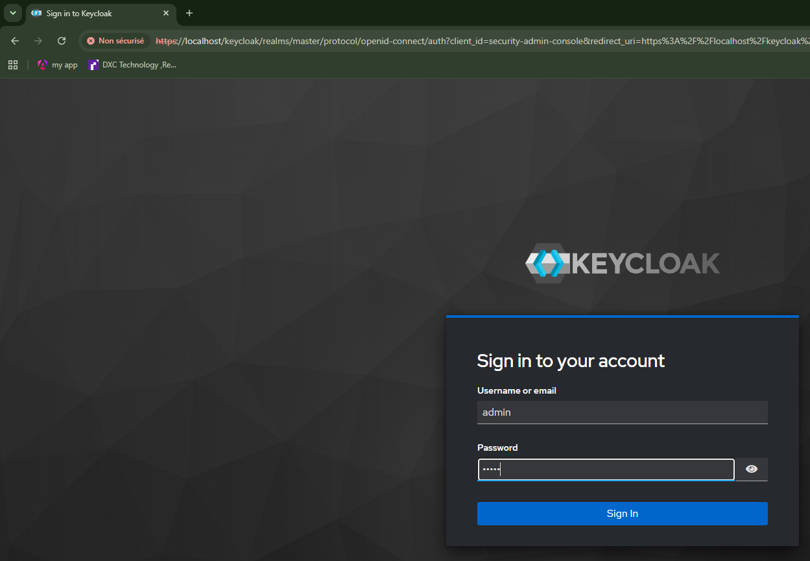

## 2. Create the realm

Click on the Manage realms left menu tab, then click on Create realm button:

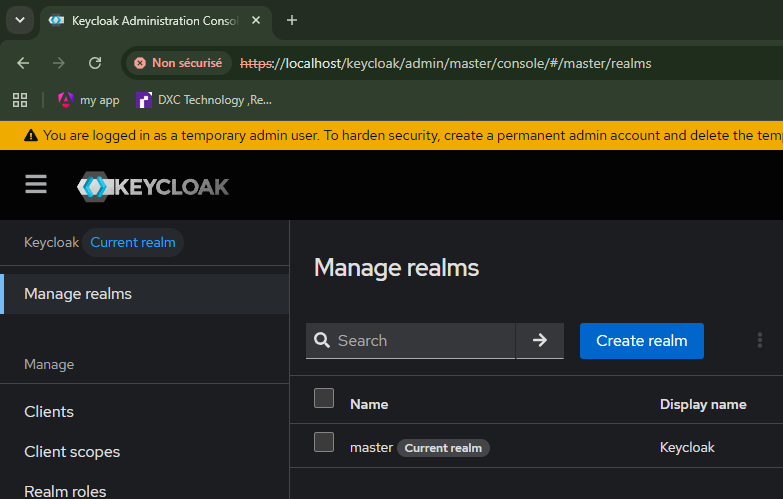

Create a realm named:

```text
carrefour_kata_realm
```

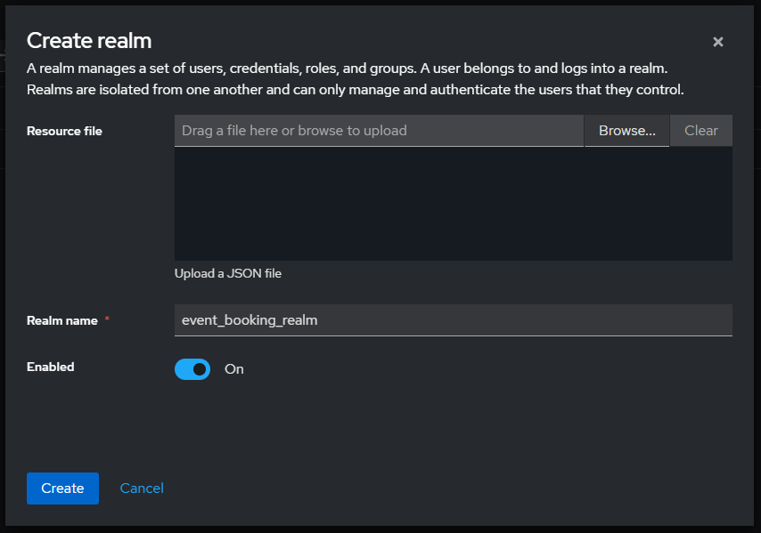

Click on the created realm in Manage realms:

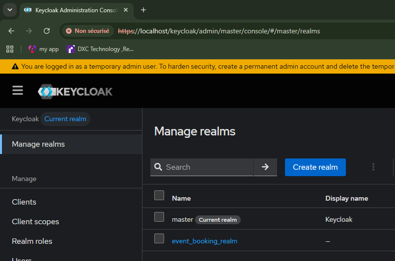

The resulting public issuer used by this application is:

```text
https://localhost/keycloak/realms/carrefour_kata_realm
```

## 3. Create the application client

After making sure the current realm is "carrefour_kata_realm" in the upper left corner.

Go to:

```text
Clients in left side menu
-> Create client button
```

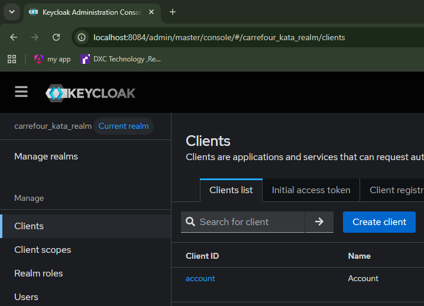

Use:

```text
Client type: OpenID Connect
Client ID:   carrefour-kata-id
```

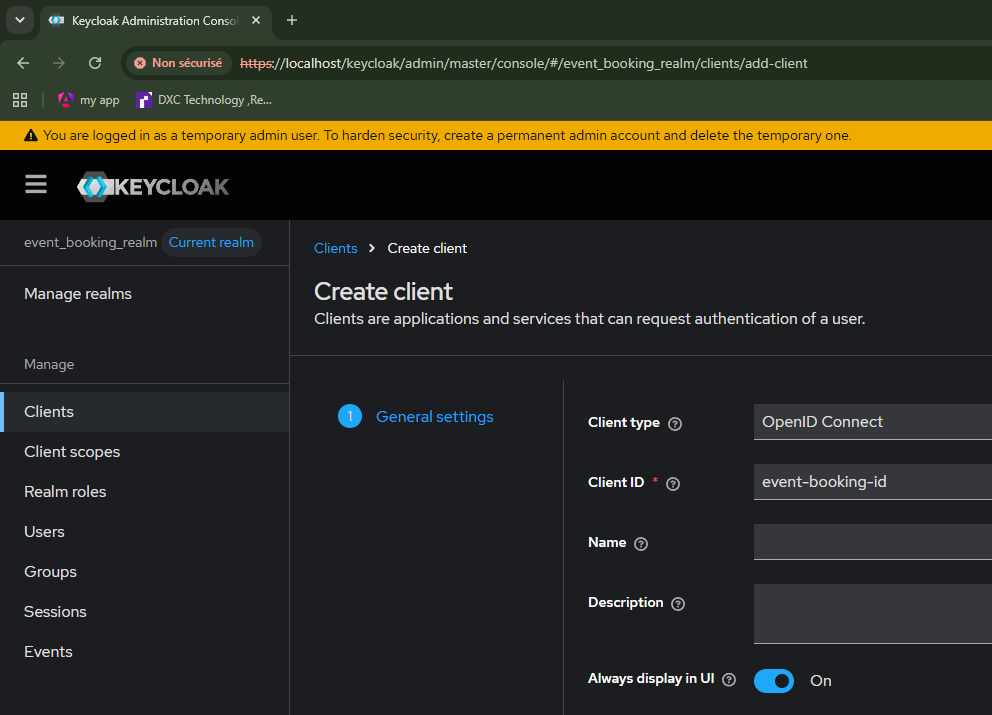

Configure the client for the BFF architecture:

```text
Client authentication: ON
Authorization:         OFF
Standard flow:         ON
Direct access grants:  OFF
Implicit flow:         OFF
Service accounts:      OFF
Require PKCE:          ON
PKCE Method:           S256
```

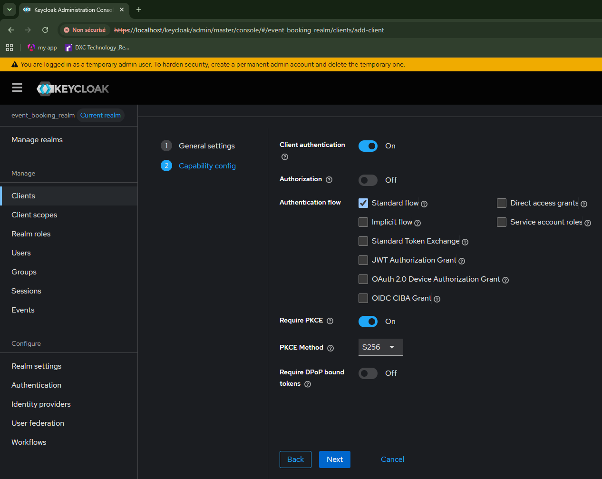

The client is confidential because the Spring BFF, rather than the Angular application, performs the server-side OAuth2 client operations.

### Login settings

Configure:

```text
Root URL:
https://localhost/

Home URL:
https://localhost/

Valid Redirect URIs:
https://localhost/login/oauth2/code/cloud-bff

Valid Post Logout Redirect URIs:
https://localhost/*

Web Origins:
https://localhost
```

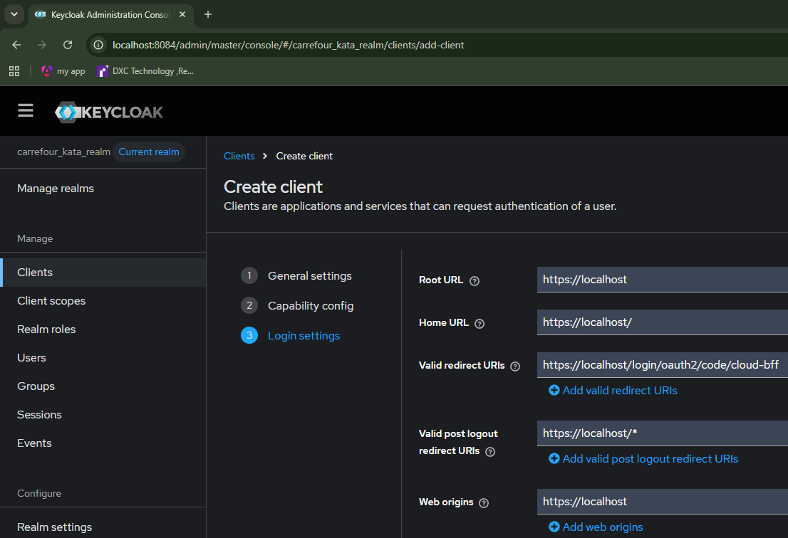

The BFF authorization requests use Authorization Code + PKCE.

## 4. Configure the client secret

Open:

```text
Clients left menu tab
-> carrefour-kata-id in the clients id list
-> Credentials tab
```

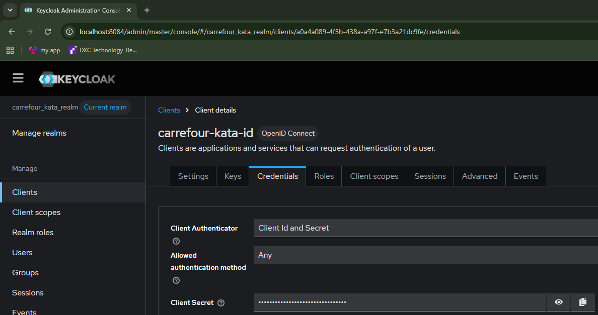

Copy the generated client secret.

Paste the generated client secret in docker-compose.yml, cloud-bff service, environment variable:

```text
CLIENT_SECRET: "clientSecret"
```

That value matches now the secret supplied to the BFF configuration corresponding to:

```text
spring.security.oauth2.client.registration.cloud-bff.client-secret
```

Use the environment/Compose variable referenced by the project for that property rather than committing the secret into source control.

If the BFF was already running when the secret was changed, recreate it after updating the environment:

```bash
docker compose up -d --force-recreate cloud-bff
```

## 5. Assign the OpenID Connect scopes

The BFF requests:

```text
openid
profile
email
```

Ensure the client has the standard `profile` and `email` client scopes assigned. `openid` is part of the OIDC request itself.

A successful authorization request should therefore contain a scope equivalent to:

```text
scope=openid profile email
```

## 6. Ensure the email claim is present

The application needs the authenticated user's email.

The client already has the `email` scope assigned.

The expected token/user-info data should contain something equivalent to:

```json
{
  "email": "user@example.com"
}
```

## 7. Create application realm roles

Create the realm roles under the Realm roles left menu tab:

```text
Realm roles
-> Create Role
```

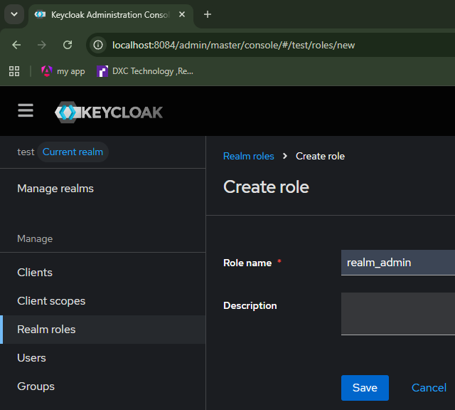

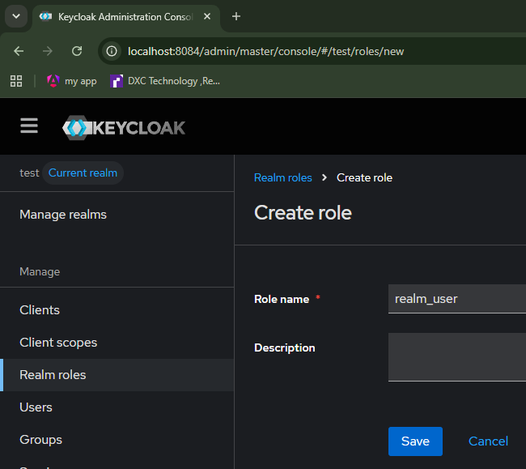

## 8. Create application client roles

Create the roles under the application client:

```text
Clients
-> carrefour-kata-id
-> Roles
```

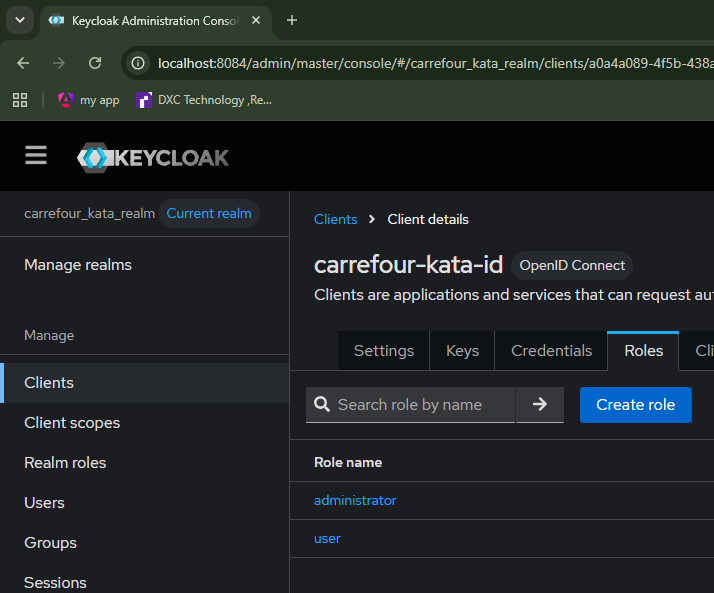

Create:

```text
user
administrator
```

`user` represents a normal authenticated application user.

`administrator` grants administrative application capabilities such as protected event-management operations.

The backend expects the access token to expose client roles under a structure equivalent to:

```json
{
  "resource_access": {
    "carrefour-kata-id": {
      "roles": [
        "user",
        "administrator"
      ]
    }
  }
}
```

Spring Security converts these into authorities such as:

```text
ROLE_user
ROLE_administrator
```

Keycloak normally supplies client roles through its standard `roles` client scope. If `resource_access.carrefour-kata-id.roles` is missing from the access token, verify the `roles` client scope / client-role mapper before adding custom code in the services.

## 9. Configure access-token audiences

The downstream services validate that the access token is intended for them.

The application-specific audiences are:

```text
event-service
reservation-service
payment-service
```

The access token may also contain Keycloak's standard `account` audience.

A working access token therefore contains audiences equivalent to:

```json
{
  "aud": [
    "event-service",
    "reservation-service",
    "payment-service",
    "account"
  ]
}
```

### Add the audience mappers

For the `carrefour-kata-id` client, open its dedicated client scope/mappers area. In Keycloak 26 this is typically:

```text
Clients
-> carrefour-kata-id
-> Client scopes
-> carrefour-kata-id-dedicated
-> Mappers
```

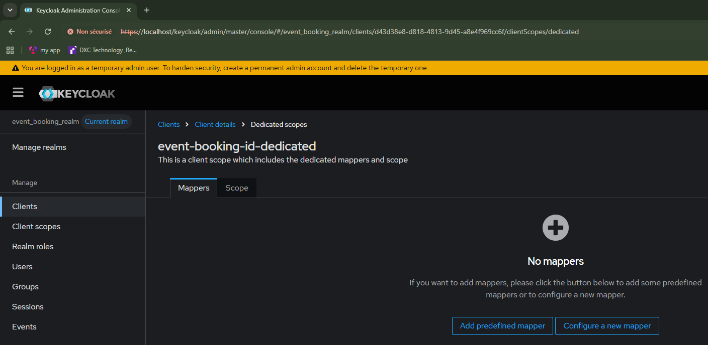

Create an **Audience** mapper for each application service.

#### Event service audience

Click on configure a new mapper.

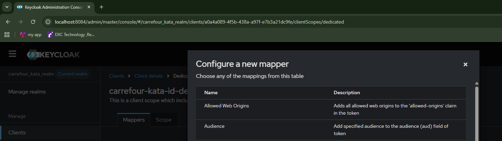

Click on Audience Name and enter:

```text
Name:                     event-service-audience
Mapper Type:              Audience
Included Custom Audience: event-service
Add to access token:      ON
```

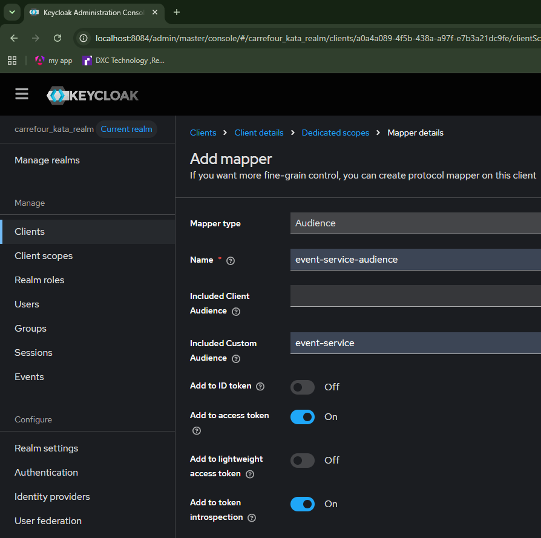


#### Reservation service audience

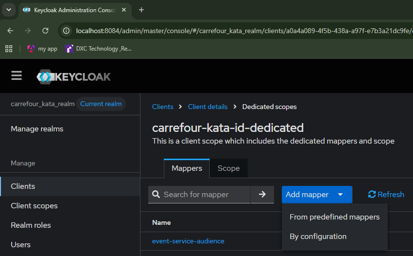

Click on Add a mapper by configuration.


Click on Audience Name and enter:

```text
Name:                     reservation-service-audience
Mapper Type:              Audience
Included Custom Audience: reservation-service
Add to access token:      ON
```

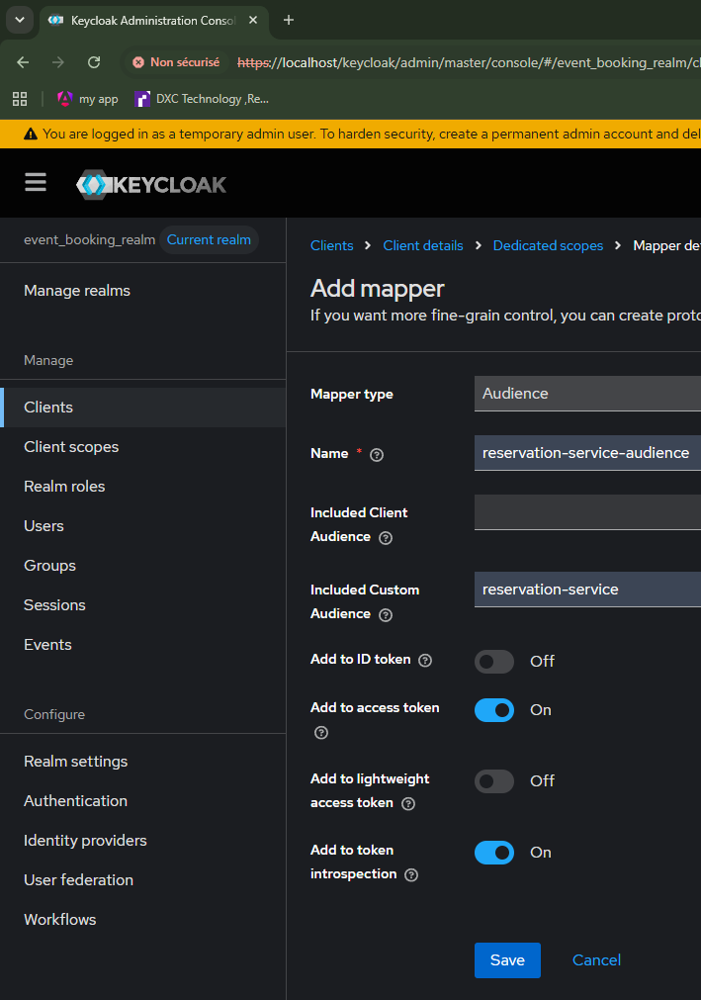

#### Payment service audience


Click on Add a mapper by configuration.


Click on Audience Name and enter:
```text
Name:                     payment-service-audience
Mapper Type:              Audience
Included Custom Audience: payment-service
Add to access token:      ON
```

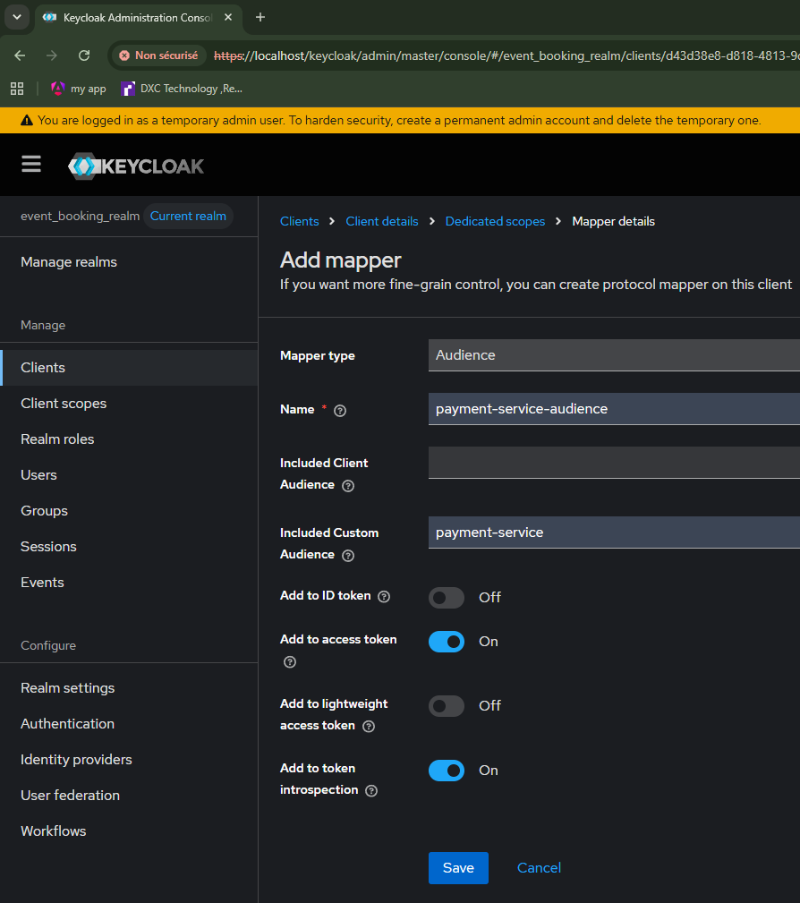

Adding these values to the **access token** is what matters for resource-server authorization. They do not need to be added to the ID token merely for downstream API authentication.

## 10. Configure login

Turn Email as username ON.

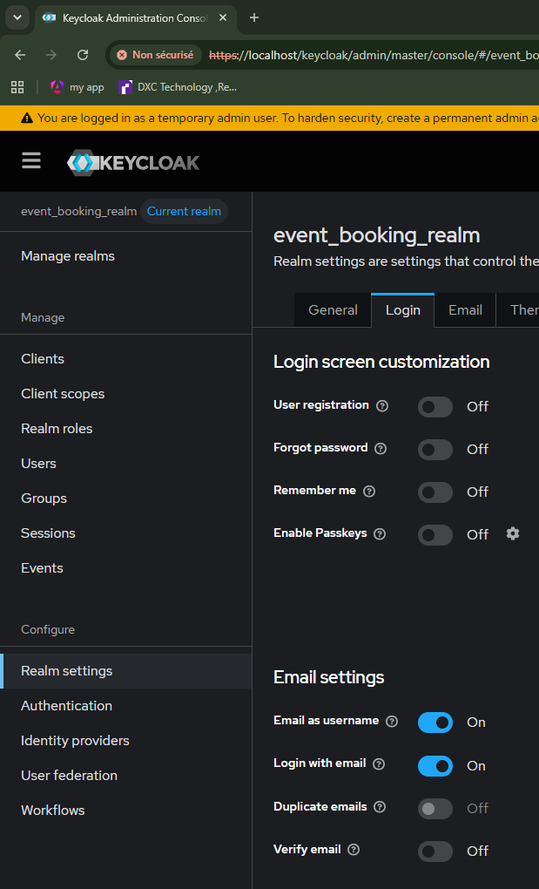

## 11. Create a test user and admin

Create a user in:

```text
Users leftmenu tab
-> Add user button
```

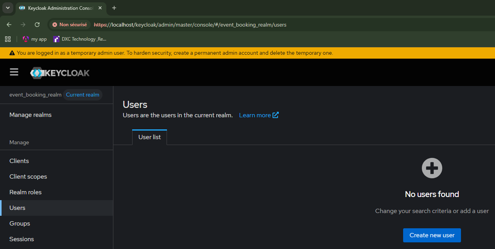

Set at least:

```text
Email verified turned ON
Email: user@carrefour.fr or admin@carrefour.fr
First name / Last name (recommended)
```

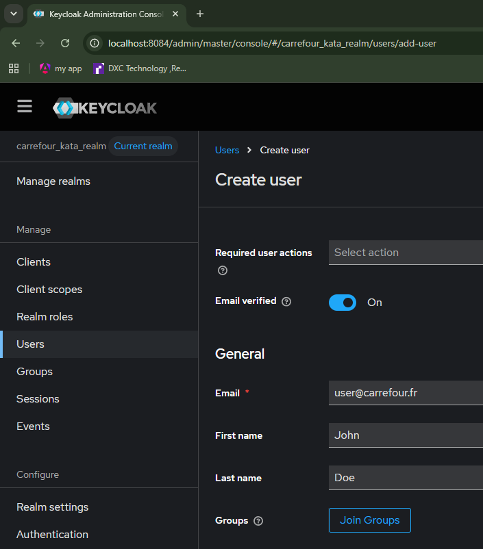

Set a password under the user's credentials and make it temporary for local testing.

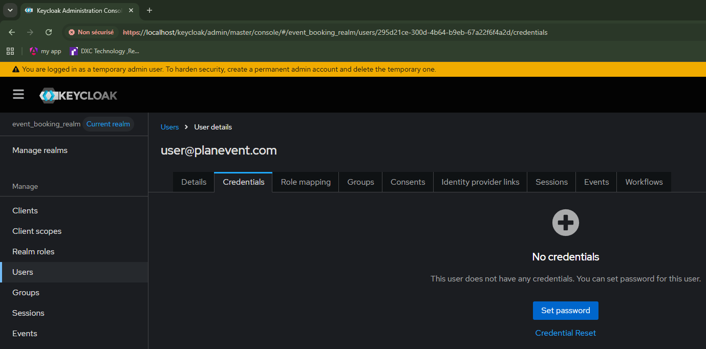

Click on Set password button.

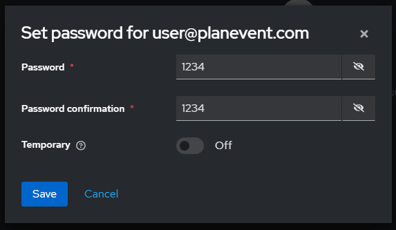

Then assign application roles:

```text
Users
-> <user>
-> Role mapping
-> Assign role
-> Client roles
```

Assign:

```text
user of client-id carrefour-kata-id
```

For an administrative test account, also assign:

```text
administrator of client-id carrefour-kata-id
```

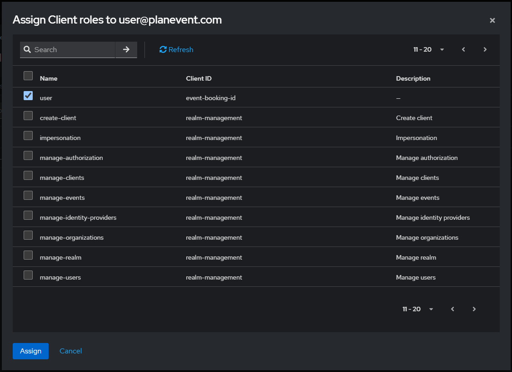

Then assign realm roles:

```text
Users
-> <user>
-> Role mapping
-> Assign role
-> Realm roles
```

Assign:

```text
user
```

For an administrative test account, also assign:

```text
administrator
```

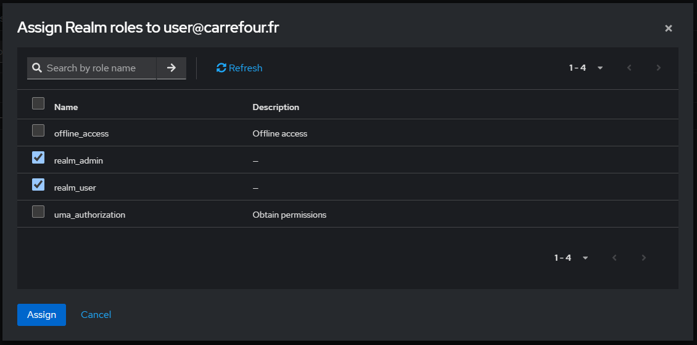

Make sure the user has an email address because the BFF exposes it through `/api/me` and the notification flow depends on user email information being available.

## 12. Validate the Keycloak setup

After login, the access token should have the essential characteristics below:

```json
{
  "iss": "https://localhost/keycloak/realms/carrefour_kata_realm",
  "azp": "carrefour-kata-id",
  "aud": [
    "event-service",
    "reservation-service",
    "payment-service",
    "account"
  ],
  "email": "user@example.com",
  "resource_access": {
    "carrefour-kata-id": {
      "roles": [
        "user"
      ]
    }
  }
}
```

An administrator should additionally have `administrator` inside the `carrefour-kata-id` role list.

---

## 13. Restart the Docker stack

From the repository root:

```bash
docker compose build
docker compose up -d
```

Check the containers:

```bash
docker compose ps
```

Wait until Keycloak is ready before opening its administration console at.

```text
https://localhost
```

Use one of Keycloak created users credentials in step 12.

```text
username: user@carrefour.fr ou admin@carrefour.fr
password: 1234
```


Keycloak is exposed by this Docker setup on port 8084 with the `/keycloak` relative path, so the direct local administration URL is based on:

```text
http://localhost:8080/keycloak/
```

The application-facing Keycloak URL is routed through Nginx at:

```text
https://localhost/keycloak/
```

# Launching the application

## First launch

From the repository root:

```bash
docker compose build
docker compose up -d
```

The first build may take longer because Docker must pull base images and Maven/npm dependencies.

Check startup:

```bash
docker compose ps
```

Follow all logs if necessary:

```bash
docker compose logs -f
```

If this is a completely fresh Keycloak volume, no need to perform the [Keycloak configuration](#keycloak-configuration) described above Keycloak volume is external.

After the client secret has been copied into the BFF's configured environment value, recreate the BFF if needed:

```bash
docker compose up -d --force-recreate cloud-bff
```

Then open:

```text
https://localhost
```

If the local gateway certificate is self-signed, the browser may display a development-certificate warning. Accept/trust the local certificate according to your operating system/browser policy.

## Foreground mode

To keep logs attached to the current terminal:

```bash
docker compose up
```

Stop it with `Ctrl+C`.

## Rebuild after source changes

To rebuild images:

```bash
docker compose build
docker compose up -d
```

Or in one command:

```bash
docker compose up -d --build
```

---

## Application URLs

The browser should normally use only the public gateway.

| Purpose | URL |
| --- | --- |
| Application | `https://localhost` |
| Start BFF login | `https://localhost/oauth2/authorization/cloud-bff` |
| Current authenticated user | `https://localhost/api/me` |
| Event API through BFF | `https://localhost/api/events` |
| Reservation API through BFF | `https://localhost/api/reservations` |
| Payment API through BFF | `https://localhost/api/payments` |
| Public Keycloak base | `https://localhost/keycloak/` |
| Public realm issuer | `https://localhost/keycloak/realms/carrefour_kata_realm` |

Do not use the Docker-internal service URLs from the browser. Addresses such as:

```text
http://event-ms:8080
http://reservation-ms:8080
http://payment-ms:8080
http://keycloak:8080
```

exist inside the Docker network.

---

## Useful Docker Compose commands

Build all images:

```bash
docker compose build
```

Start all services:

```bash
docker compose up -d
```

Start and rebuild:

```bash
docker compose up -d --build
```

Show service status:

```bash
docker compose ps
```

Follow all logs:

```bash
docker compose logs -f
```

Follow individual services:

```bash
docker compose logs -f cloud-bff
docker compose logs -f event-ms
docker compose logs -f reservation-ms
docker compose logs -f payment-ms
docker compose logs -f notif-ms
```

Restart one service:

```bash
docker compose restart cloud-bff
```

Recreate one service after an environment/configuration change:

```bash
docker compose up -d --force-recreate cloud-bff
```

Stop and remove containers/network while preserving named volumes:

```bash
docker compose down
```

Remove containers **and volumes**:

```bash
docker compose down -v
```

> `docker compose down -v` is destructive for persisted local state. It can remove MongoDB data and persisted Keycloak configuration. Use it only when an intentional full reset is required.

---

# Tests and code coverage

The Java services contain unit and integration tests.

The test strategy includes domain/application unit tests, WebFlux controller/security tests, Reactor tests with `StepVerifier`, MongoDB integration tests with Testcontainers, Kafka integration tests with Testcontainers, and BFF proxy/security/correlation/CORS/aggregation tests.

Run the full Maven verification lifecycle inside a Java service:

```bash
mvn clean verify
```

This is preferable to `mvn test` when the module has Failsafe integration tests and JaCoCo verification configured.

JaCoCo reports are generated under:

```text
target/site/jacoco/index.html
```

cloud-bff, reservation-ms and event-ms are above 80% coverage.

The project uses explicit coverage gates where configured rather than excluding behavior-heavy classes merely to increase the percentage.

### Docker builds

Java Dockerfiles use a multi-stage build based on JDK 25.

A typical build stage includes:

```dockerfile
COPY pom.xml .
RUN mvn dependency:go-offline -B

COPY src ./src
RUN mvn clean verify -B
```

`dependency:go-offline` pre-resolves Maven dependencies/plugins. Because `pom.xml` is copied before the source tree, Docker can reuse that dependency layer while the POM remains unchanged.

`-B` means Maven **batch mode**, which is appropriate for Docker and CI because Maven does not expect interactive input.

Tests were omitted for payment and notification microservices, payment is just a simulation and notification is a logging service.

Using `mvn clean verify` during the image build means a Docker image is not produced when the module's tests or configured quality gates fail.

---

# Troubleshooting

## `401 Unauthorized` on `/api/**`

`/api/**` is protected by the BFF. Make sure the browser completed the Keycloak login, the BFF session cookie exists, Redis is running and reachable from `cloud-bff`, and the Keycloak client configuration matches the BFF configuration.

Opening:

```text
https://localhost/oauth2/authorization/cloud-bff
```

starts the login flow.

## Keycloak login redirects fail from inside Docker

Do not configure Docker containers to call:

```text
https://localhost/keycloak/...
```

as though `localhost` referred to the Keycloak container.

Inside Docker, use Keycloak's Docker service name for internal token/JWK calls, for example:

```text
http://keycloak:8080/keycloak/realms/carrefour_kata_realm/protocol/openid-connect/certs
```

while preserving the public token issuer:

```text
https://localhost/keycloak/realms/carrefour_kata_realm
```

## `502 Bad Gateway` from Nginx

Check that the target container is healthy/running:

```bash
docker compose ps
```

Then inspect gateway and target-service logs:

```bash
docker compose logs -f gateway
docker compose logs -f cloud-bff
```

A 502 can also occur temporarily while an upstream container is still starting.

## `502 Bad Gateway` from the BFF API proxy

The BFF maps downstream connection/request failures to HTTP 502. Check the relevant service and verify that the BFF uses Docker service URLs rather than `localhost`.

## `504 Gateway Timeout`

The BFF applies explicit downstream timeouts. A 504 indicates the downstream operation exceeded the configured timeout/read limit. Inspect the target microservice and its dependencies.

## `403 Forbidden` on an authenticated POST/PUT/PATCH/DELETE

First distinguish authorization from CSRF.

For browser session requests, Angular must return the CSRF token using:

```text
X-XSRF-TOKEN
```

If the request reaches a role-protected endpoint, also verify that the Keycloak user has the required client role.

## Administrator is logged in but admin operations are forbidden

Verify that the access token contains:

```json
{
  "resource_access": {
    "carrefour-kata-id": {
      "roles": [
        "administrator"
      ]
    }
  }
}
```

Assign the role as a **client role of `carrefour-kata-id`**, not merely as an unrelated realm/client role.

## Microservice rejects the token because of audience

Verify the access token contains the required custom audience:

```text
event-service
reservation-service
payment-service
```

If one is missing, check the corresponding Keycloak Audience mapper and ensure `Add to access token` is enabled.

## Email is null/missing

Verify all three parts:

```text
The Keycloak user has an email address
The client requests/has the email scope
The email mapper adds the email claim
```

The mapper should make `email` available in the ID token/access token/userinfo according to the application configuration.

## MongoDB: UUID representation error

If a service reports an error similar to:

```text
The uuidRepresentation has not been specified
```

verify the service has:

```yaml
spring:
  mongodb:
    representation:
      uuid: standard
```

and uses a valid MongoDB connection string beginning with `mongodb://` or `mongodb+srv://`.

## MongoDB connection refused on `localhost`

Inside Docker, use the Mongo service name, not a host-local mapped port. For example:

```text
mongodb://mongo-payment:27017/payment_db
```

not a host-side `localhost` port mapping.

## Kafka consumer cannot deserialize an event

Check that producer and consumer agree on the topic, serialization format, event schema, and type-header/default-type configuration where applicable.

For a consumer to recover cleanly from malformed records, configure the consumer error/deserialization strategy rather than allowing a raw deserialization exception to permanently block the partition.

## Local HTTPS certificate warning

The gateway terminates HTTPS using the localhost certificate mounted under the gateway certificate directory.

The expected Nginx-side certificate names are:

```text
localhost.crt
localhost.key
```

If they are development/self-signed certificates, the browser can warn until the certificate is trusted locally.

## Resetting all local state

For a complete local reset:

```bash
docker compose down -v
docker compose build
docker compose up -d
```

Remember that removing volumes also removes persisted local databases and may remove the manually configured Keycloak realm/client. Re-run the Keycloak setup afterward.

---

## Security summary

The intended browser trust boundary is:

```text
Browser
   |
   | HTTPS + session cookie + CSRF token
   v
Nginx
   |
   v
cloud-bff
   |
   | server-side OAuth access token
   v
microservices
```

The browser does not receive or manage downstream Bearer tokens. Internal services validate Keycloak JWTs and apply their own authorization rules, while the BFF centralizes login/session concerns and user-oriented API aggregation.

## Functional and technical features to add later on

### Payment microservice

###### Use a real banking payment provider to handle payments.

### Event microservice

###### Have multiple MVP tiers for seats, each tier with its own price, not the same price for all event seats.

### Notification microservice

###### Use spring-mail to implement a real SMTP server.

### Reservation microservice

###### Adding the possibility of reserving multiple seats instead of one at a time.

### Front

###### Adding a UI seat layout the user chooses the desired seats from.

###### Adding pagination and sorting capabilities when browsing events, reservations and payments.

### Customer microservice

###### Design and implement this microservice to handle our customer business logic, keycloak sign-up process so users can create their own accounts.

### MongoDB

###### Transform each database into a three nodes cluster replica set with one write primary DB and two read replicas backups. This will allow us to implement a Transactional Outbox mechanism to handle Kafka reservation and payment publishers failures.

### Cloud-BFF

###### Add a single-flight refresh mechanism so concurrent requests sharing the same BFF session reuse one Keycloak token refresh, preventing duplicate refreshes and multiple BFFSESSION/CSRF rotations. For horizontally scaled BFF instances, this coordination should be distributed via Redis.
